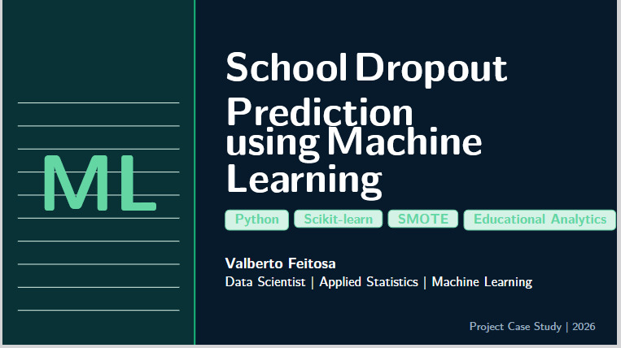

# 🎓 Machine Learning for School Dropout Prediction


<p align="center">
  
</p>

---

# Overview

This repository presents a Machine Learning study for predicting student failure in first-semester Mathematics as an early indicator of school dropout risk.

The project applies data preprocessing, class balancing (SMOTE), feature selection and supervised learning algorithms to identify students at higher academic risk, supporting evidence-based educational decision making.

The repository documents a peer-reviewed scientific publication published in **Research, Society and Development (2025)**.

---

# Table of Contents

- Overview
- Problem
- Objectives
- Dataset
- Machine Learning Pipeline
- Technologies
- Machine Learning Models
- Results
- Repository Contents
- Data Availability
- Scientific Publication
- Citation
- Author
- License

---

# Problem

School dropout remains one of the major challenges faced by educational institutions.

Previous studies indicate that poor academic performance during the first semester is one of the strongest indicators associated with future dropout.

This work investigates whether Machine Learning techniques can identify students at higher academic risk and support early pedagogical interventions.

---

# Objectives

- Predict student failure in first-semester Mathematics.
- Support early educational interventions.
- Compare supervised Machine Learning algorithms.
- Evaluate predictive performance using statistical metrics.
- Demonstrate the application of Educational Data Mining techniques.

---

# Dataset

The study uses anonymized academic records from the Federal Institute of Education, Science and Technology of Ceará (IFCE).

### Characteristics

- 468 student records
- Six technical education programs
- Admission years: 2018–2020
- Anonymous educational data
- Binary classification

Target classes:

- ✅ Pass
- ❌ Fail

---

# Machine Learning Pipeline

The methodology consists of:

1. Data Collection
2. Data Cleaning
3. Exploratory Data Analysis (EDA)
4. Feature Engineering
5. One-Hot Encoding
6. Class Balancing (SMOTE)
7. Feature Selection (SelectKBest)
8. Model Training
9. Cross Validation
10. Model Evaluation

---

# Technologies

- Python
- Pandas
- NumPy
- Scikit-learn
- Imbalanced-learn (SMOTE)
- Matplotlib
- Jupyter Notebook

---

# Machine Learning Models

The following supervised learning algorithms were evaluated:

- Logistic Regression
- Gaussian Naive Bayes

Evaluation metrics:

- Accuracy
- Precision
- Recall
- F1-score
- ROC-AUC
- Cross Validation

---

# Results

The best-performing model was **Logistic Regression**.

| Metric | Value |
|---------|-------:|
| Accuracy | 0.73 |
| ROC-AUC | 0.77 |
| Cross Validation | 0.68 |

The results demonstrate the potential of Machine Learning to support early identification of students at risk of academic failure.

---

# Repository Contents

```
machine-learning-school-dropout/

├── images/
│   └── banner-project.jpeg
│
├── paper/
│   ├── article.pdf
│   └── project-case-study.pdf
│
├── README.md
├── LICENSE
└── .gitignore
```

---

# Data Availability

The original dataset and the complete implementation notebook are **not publicly available**.

They contain institutional academic records subject to privacy, ethical and institutional restrictions.

This repository provides:

- Project documentation
- Methodological overview
- Published scientific article
- Project case study
- Main experimental results

Researchers interested in further information are welcome to contact the corresponding author.

---

# Scientific Publication

This repository is based on the peer-reviewed publication:

**Machine Learning: An Application for School Dropout Prevention**

Research, Society and Development

Volume 14, Issue 6 (2025)

DOI:

https://doi.org/10.33448/rsd-v14i6.49029

### Documents

📄 **Published Article**

`paper/article.pdf`

📘 **Project Case Study**

`paper/project-case-study.pdf`

---

# Citation

```bibtex
@article{Pereira2025,
  title={Machine Learning: An Application for School Dropout Prevention},
  author={Pereira, Valberto Rômulo Feitosa and collaborators},
  journal={Research, Society and Development},
  volume={14},
  number={6},
  year={2025},
  doi={10.33448/rsd-v14i6.49029}
}
```

---

# Author

## Valberto Feitosa

**Data Scientist | Applied Statistics | Machine Learning | Educational Analytics**

Professor and Researcher at the Federal Institute of Education, Science and Technology of Ceará (IFCE).

- GitHub: https://github.com/ValbertoFeitosa
- LinkedIn: https://www.linkedin.com/in/valberto-feitosa-7239511b1/

---

# License

This project is distributed under the **MIT License**.
